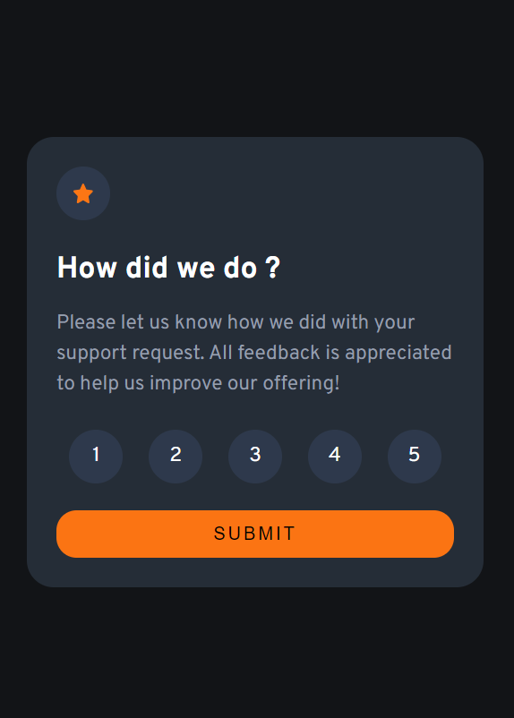
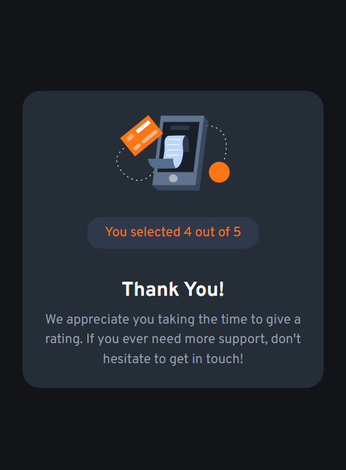
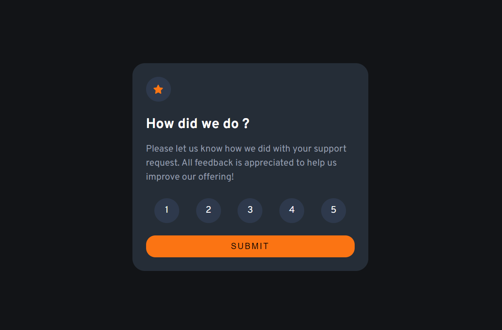
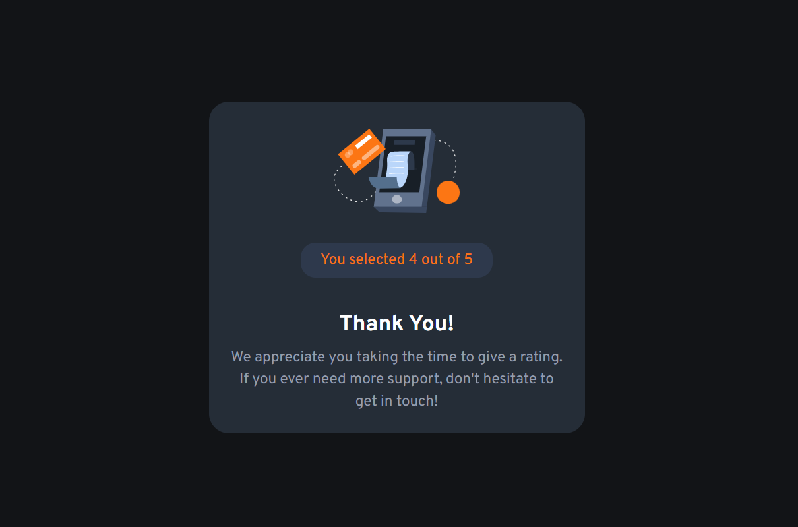
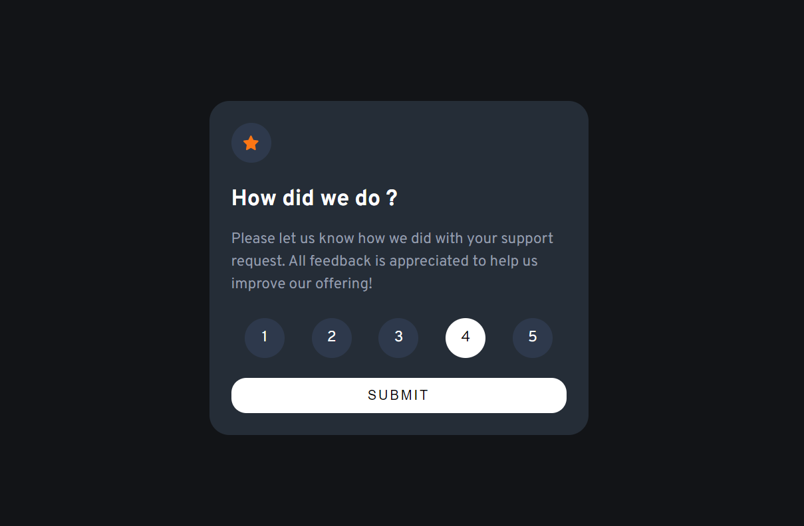
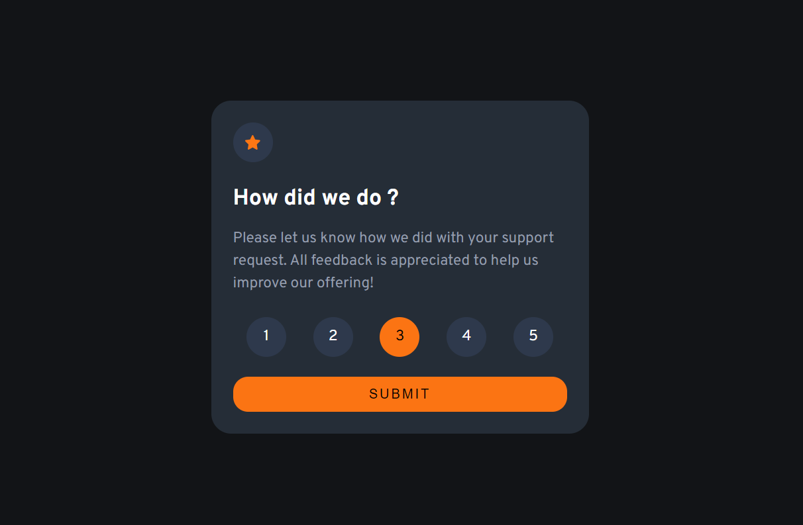

# Frontend Mentor - Interactive rating component solution

This is a solution to the [Interactive rating component challenge on Frontend Mentor](https://www.frontendmentor.io/challenges/interactive-rating-component-koxpeBUmI). Frontend Mentor challenges help you improve your coding skills by building realistic projects.

## Table of contents

- [Overview](#overview)
  - [Screenshot](#screenshot)
  - [Links](#links)
- [My process](#my-process)
  - [Built with](#built-with)
- [Author](#author)

## Overview

### Screenshot

### Links

- Solution URL: (https://github.com/risangabdurrahmang/frontend-mentor-interactive-rating-component)
- Live Site URL: (https://risangabdurrahmang.github.io/frontend-mentor-interactive-rating-component/)

## My process

### Built with

- Semantic HTML5 markup
- CSS custom properties
- Flexbox
- Mobile-first workflow

## Author

- Website - [Risang Abdurrahman Gustiwa](https://risangabdurrahmang.github.io/)
- Frontend Mentor - [@risangabdurrahmang](https://www.frontendmentor.io/profile/risangabdurrahmang)
